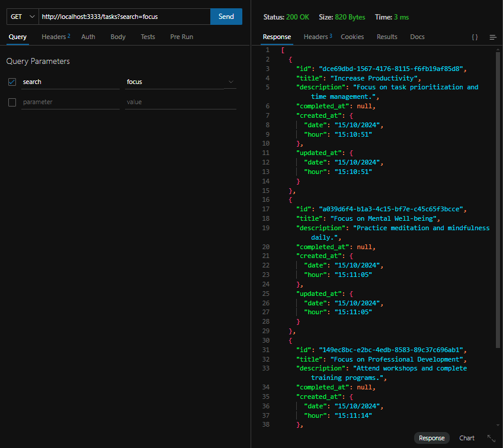

# API Rest de criação de tarefas - Desafio 1 trilha Node.JS da Rocketseat



# Sumário

- [Objetivos do projeto](#objetivos-do-projeto) -[CSV](#csv)
- [Rotas e regras de negócio](#rotas-e-regras-de-negócio)
  - [Estrutura(propriedades) de uma task](#estrutura-propriedades-de-uma-task)
  - [Rotas](#rotas)
  - [Implementações extras](#implementações-extras)
- [Desenvolvimento do projeto](#desenvolvimento-do-projeto)
  - [Buffers](#buffers)
  - [Utils](#utils)
    - [Build Route Paths](#build-route-paths)
    - [Extract Query Params](#extract-query-params)
  - [Servidor](#servidor)
  - [Banco de dados e rotas](#banco-de-dados-e-rotas)
    - [Rota de listagem de metas (GET)](#rota-de-listagem-de-metas-get)
    - [Rota de criação de metas (POST)](#rota-de-criação-de-metas-post)
    - [Rota de exclusão de meta (DELETE)](#rota-de-exclusão-de-meta-delete)
    - [Rota de atualização de dados da meta (PUT))](#rota-de-atualização-de-dados-da-meta-put)
    - [Rota de conclusão de uma tarefa (PATCH)](#rota-de-conclusão-de-uma-tarefa-patch)
  - [CSV](#csv)
- [Como rodar o projeto](#como-rodar-o-projeto)
- [Autor](#autor)

## Objetivos do projeto

1. Criação de uma task
2. Listagem de todas as tasks
3. Atualização de uma task pelo `id`
4. Remover uma task pelo `id`
5. Marcar pelo `id` uma task como completa
6. Importação de tasks em massa por um arquivo CSV

### CSV

Um arquivo CSV (Comma-Separated Values/Valores separados por vírgula) é um formato de arquivo de texto simples onde os dados são armazenados em linhas, e cada valor dentro de uma linha é separado por uma vírgula. Esse formato é amplamente utilizado para armazenar e compartilhar dados tabulares, como planilhas e bancos de dados.

Cada linha do arquivo representa um registro, e as colunas são separadas por vírgulas. Por exemplo, um arquivo CSV que lista tarefas poderia ser assim:

```csv
title,description
Task 01,Descrição da Task 01
Task 02,Descrição da Task 02
```

O objetivo é adicionarmos um arquivo em formato CSV para cadastro de múltiplos dados simultaneamente.

Esse processo de importação em massa é útil quando você tem muitas tarefas para cadastrar e não quer fazer isso manualmente uma a uma.

## Rotas e regras de negócio

### Estrutura (propriedades) de uma task

- `id` - Identificador único de cada task
- `title` - Título da task
- `description` - Descrição detalhada da task
- `completed_at` - Data de quando a task foi concluída. O valor inicial deve ser `null`
- `created_at` - Data de quando a task foi criada.
- `updated_at` - Deve ser sempre alterado para a data de quando a task foi atualizada.

### Rotas

- `POST - /tasks`
  - Criar uma task no banco de dados, enviando os campos `title` e `description` por meio do `body` da requisição.
  - Ao criar uma task, os campos: `id`, `created_at`, `updated_at` e `completed_at` devem ser preenchidos automaticamente.
- `GET - /tasks`
  - Listar todas as tasks salvas no banco de dados.
  - Realização de buscas, filtrando as tasks pelo `title` e `description`
- `PUT - /tasks/:id`
  - Atualizar uma task pelo `id`.
  - No `body` da requisição, será recebido somente o `title` e/ou `description` para serem atualizados.
  - Envio de um único dado o outro não pode ser atualizado e vice-versa.
  - Antes da atualização, é realizado uma validação se o `id` pertence a uma task salva no banco de dados.
- `DELETE - /tasks/:id`
  - Remoção de uma task pelo `id`.
  - Antes da remoção, o `id` é validado ao chegar se ele pertence a uma task salva no banco de dados.
- `PATCH - /tasks/:id/complete`
  - Marcação de conclusão de uma task. Quando uma task é concluida retorna ao seu estado “normal”.
  - Antes da alteração o `id` é validado ao checar se ele pertence a uma task salva no banco de dados.

### Implementações extras

- Validação das propriedades `title` e `description` nas rotas `POST` e `PUT`, para checar se são válidas e não nulas, no `body` da requisição.
- Nas rotas que recebem o `/:id`, realizado validação do `id`, para chegar se ele existe no banco de dados e é retornado à requisição com uma mensagem informando que o registro não existe.

## Desenvolvimento do projeto

O projeto foi totalmente construído com `node` sem nenhum framework. Vamos explicar por partes:

`./src/server.js` - Criação inicial do servidor.

```js
import http from "node:http";
const port = 3333;

const server = http.createServer(async (req, res) => {
  console.log("Hello World");
});

server.listen(port, () => {
  console.log(`Server running on http://localhost:${port}`);
});
```

Primeiramente precisamos lidar com os dados retornados pelo `req.body`. Tanto o `request` quando o `response` das nossas requisições `http` são streams, ou seja, os dados são enviados em partes em formato de `buffer` que são vários pedaços, ou `chunks` de dados que são carregados aos poucos em formato binário, que não conseguimos entender.
Assim precisamos de uma função que retorne todo o corpo da requisição primeiro e em formato JSON, antes de continuarmos.

### Buffers

`.src/middlewares/json.js`

```js
import { Buffer } from "node:buffer";

export const json = async (req) => {
  const buffers = [];

  for await (const chunk of req) {
    buffers.push(chunk);
  }

  try {
    req.body = JSON.parse(Buffer.concat(buffers).toString());
  } catch {
    req.body = null;
  }
};
```

- Importamos o `Buffer`.
- Criamos uma função assíncrona que receberá o `req`(request) como parâmetro
- Construimos um array chamado `buffers` que vai conter todos os `chunks` da requisição, ou seja, os pedaços que virão com o tempo.
- Utilizando o iterador `for await` a cada vez que um novo `chunk` do `req` vier, será adicionado ao `buffers`.
- Quando todos os chunks estiverem dentro do `buffers`, definimos req.body:
  - O `Buffer` utiliza o método `.concat()` para concatenar todos os buffers em um só e transformá-lo em string com o `toString()`.
  - Transformamos nossa string em formato `JSON`, que é como vamos conseguir ler e entender os dados provindos do `body`.
  - Caso a operação não seja bem sucedida, o retorno será `null`.

```js
const server = http.createServer(async (req, res) => {
  await json(req);
}
```

- Adicionamos essa função no corpo do servidor. Assim o retante da aplicação só dará seguimento após conversão da requisição em json.

### Utils

Antes de darmos seguimento nas rotas e no banco de dados, precisamos especificar duas funções responsáveis por funcionalidades importantes no nosso projeto:

#### Build route paths

```js
export function buildRoutePath(path) {
  // 1
  const routeParametersRegex = /:([a-zA-Z]+)/g; // 2
  const pathWithParams = path.replaceAll(
    routeParametersRegex,
    "(?<$1>[a-z0-9-_]+)" // 3
  );
  const pathRegex = new RegExp(`^${pathWithParams}(?<query>\\?(.*))?$`); // 4

  return pathRegex;
}
```

Essa função é responsável por criar uma expressão regular que pode ser usada para capturar parâmetros dinâmicos em uma rota de URL, o que usaremos muito em rotas que precisam do `id` da meta, como **"/tasks/:id"**.

**Resumo:**

- A função `buildRoutePath` transforma uma rota com parâmetros dinâmicos (ex: `/tasks/:id`) em uma expressão regular que pode ser usada para correspondência de URLs, capturando os parâmetros e uma possível query string.
- Essa funcionalidade é útil para criar um roteador que possa lidar com diferentes URLs de forma flexível, extraindo dados relevantes da URL para processamento posterior.

#### Extract Query Params

```js
export function extractQueryParams(query) {
  return query
    .slice(1)
    .split("&")
    .reduce((queryParams, param) => {
      const [key, value] = param.split("=");

      queryParams[key] = value;
      return queryParams;
    }, {});
}
```

**Resumo:**

- A função `extractQueryParams` transforma uma string de consulta em um objeto JavaScript, onde cada chave é um nome de parâmetro e cada valor é o valor correspondente.
- Por exemplo, para uma string de consulta como `http://localhost:3333/tasks?id=123&name=John`, a função retornaria o objeto

```js
{
  id: "123",
  name: "John"
}
```

- Isso ajuda a processar e manipular parâmetros de consulta de URLs.

### Servidor

```js
const server = http.createServer(async (req, res) => {
  const { method, url } = req; // 1

  await json(req); // 2

  const route = routes.find((route) => {
    return route.method === method && route.path.test(url);
  }); // 3

  if (route) {
    const routeParams = url.match(route.path); // 4
    const { query, ...params } = routeParams.groups || {}; // 4

    req.params = params; // 4
    req.query = query ? extractQueryParams(routeParams.groups.query) : {}; // 4

    return route.handler(req, res); // 5
  }

  return res.writeHead(404).end();
});
```

1. Extração do método e url: `const { method, url } = req`extrai o método HTTP (GET, POST, ectc) e a URL da requisição.
2. Chama a função json para processar o corpo da requisição de `buffer` para `json`, como explicamos anteriormente.
3. Procurando a rota na lista de rotas `routes` e o `path.test(url)` verifica se a URL coresponde ao padrão definido na rota. O `test()` é devido que a nossa url é uma `Regex` devido a função `buildRoutePaths()` e é usada nas rotas, onde veremos já.
4. Tratamento da rota: Se uma rota correspondente for encontrada, a URL é combinada com a rota para extrair os parâmetos dlea utilizando `url.match(route.path)`. Os parâmetros são armazenamos em `req.params`, e os parâmetros de consulta (queryParams) são extraidos com a função `extractQueryParams()` que já vimos.
5. A função manipuladora `handler`da rota correspondente é chamada, passando o `req`e o `res`. Todas as rotas possuem uma função handler, que será responsável por ldiar com a requisição e resposta do servidor.

### Banco de dados e rotas

Vamos explicar agora cada uma das funções oferecidas pelo banco de dados e como elas são implementadas nas rotas do nosso servidor.

- `./src/database.js`
- `./src/routes.js`

```js
export class Database {
  #database = {};
}
```

A classe Database atua como um gerenciador de banco de dados, armazenando os dados em um objeto privado exclusivo da classe. Propriedades que começam com `#` são privadas e acessíveis apenas dentro da classe.

```js
const databasePath = new URL("../db.json", import.meta.url);

export class Database {
  #database = {};

  constructor() {
    fs.readFile(databasePath, "utf-8")
      .then((data) => {
        this.#database = JSON.parse(data);
      })
      .catch(() => {
        this.#persist();
      });
  }

  #persist() {
    fs.writeFile(databasePath, JSON.stringify(this.#database));
  }
}
```

Além disso, temos duas funções importantes no banco:

- #constructor: é responsável por ler o arquivo `db.json` na constante `databasePath`, onde os dados do banco de dados são armazenados. A leitura é assíncrona e, uma vez completada, os dados são atribuídos a `this.#database`. Se o arquivo não existir, a função `#persist` será chamada para inicializar o banco.

- #persist: Grava os dados contidos em `this.#database` no arquivo `db.json`, garantindo que as atualizações sejam persistidas sempre que o banco de dados é modificado.

`./src/routes.js`

```js
const db = new Database();
```

Instanciamos o nosso banco de dados, que vamos mostrar já, para utilizarmos suas funções nas nossas rotas.

#### Rota de listagem de metas (GET)

```js
export const routes = [
  {
    method: "GET",
    path: buildRoutePath("/tasks"),
    handler: (req, res) => {
      const { search } = req.query;

      const tasks = db.selectAll(
        "tasks",
        search ? { title: search, description: search } : null
      );

      return res.writeHead(200).end(JSON.stringify(tasks));
    },
  },
];
```

Todas as rotas possuem o método, o caminho e a função a ser executada caso o método e o caminho coincidam com os da requisição ao servidor.

Utilizamos a função `buildRoutePath` em todas as nossas rotas.

Na função handler buscamos o parâmetro `search` do `req.query`, como `http://localhost:3333/tasks?search=John`, por exemplo.

Caso haja um `query params` buscamos os registros no banco de dados onde o título ou a descrição de uma `task` possua a palavra utilizada na pesquisa, ou caso nenhuma task coincida com a pesquisa, nada é retornado. Caso não haja uma pesquisa, todas as `tasks` são retornadas.

No banco de dados observamos isso:

```js
  selectAll(table, search) {
    let data = this.#database[table] ?? [];

    if (search) {
      data = data.filter((row) => {
        return Object.entries(search).some(([key, value]) => {
          return row[key].toLowerCase().includes(value.toLowerCase());
        });
      });
    }

    return data;
  }
```

- selectAll: recebe os parâmetros `table`(nome da tabela, como "tasks") e `search`(os query params).
- Caso hajam dados, são retornados todos os dados da tabela, caso não, é retornado um array vazio
- Caso existam parâmetros de pesquisa, os dados são filtrados e é retornado somente os dados que atendem aos filtos. Além disso, é garantido que a pesquisa não seja sensível a maiúsculas e minúsculas.

#### Rota de criação de metas (POST)

```js
  {
    method: "POST",
    path: buildRoutePath("/tasks"),
    handler: (req, res) => {
      const { title, description } = req.body; // 1

      // ... verificações se o title e description atendem aos requisitos de preenchimento

      const now = new Date();

      const formattedDateTime = {
        date: now.toLocaleDateString("pt-BR"),
        hour: now.toLocaleTimeString("pt-BR"),
      }; // 2

      const task = {
        id: randomUUID(),
        title,
        description,
        completed_at: null,
        created_at: formattedDateTime,
        updated_at: formattedDateTime,
      }; // 3

      db.insert("tasks", task); // 4

      return res.writeHead(201).end();
    },
  },
```

1. Essa rota exige do corpo da requisição um `title` e um `description`
2. Dados do horário e dia atuais são coletados
3. Montamos a estrutura da `task`:

- id: `id` randômico gerado pelo `randomUUID()` nativo do node
- o `title` e o `description` retornados no `req.body`
- completed_at: começa como null, pois acabou de ser criado, portanto, não foi concluida ainda.
- created_at e updated_at: recebem os dados de horário e data atuais, pois acabaram de ser criadas, consequentemente atualizadas.

4. Chamada a função `inser` do nosso banco de dados, recebendo o nome da tabela `"tasks"` e nossa nova tarefa, que é um objeto.

`./src/database.js`

```js
  insert(table, data) {
    if (Array.isArray(this.#database[table])) {
      this.#database[table].push(data);
    } else {
      this.#database[table] = [data];
    }

    this.#persist();
    return data;
  }
```

- Primeiro é conferido se o `this.#database[table]` é um array, para sabermos se estamos lidando com uma coleção de dados e que essa tabela existe. Caso seja um array, os dados recebidos em data, no caso, nosso objeto `task` é adicionado ao nosso banco.
- Caso não seja um array, o código inicializa essa tabela com um array contendo somente o novo dado.
- O método `#persist` é chamado para persistir os dados na tabela.

#### Rota de exclusão de meta (DELETE)

```js
  {
    method: "DELETE",
    path: buildRoutePath("/tasks/:id"),
    handler: (req, res) => {
      const { id } = req.params; // 1
      const checkId = db.selectUnique("tasks", id); // 2

      if (!checkId) {
        return res.writeHead(404).end("Task not found");
      } // 3

      db.delete("tasks", id); // 4
      return res.writeHead(204).end();
    },
  },
```

1. Recebemos o id do `req.params`.
2. Utilizamos a função do banco de dados para encontrar uma `task` com o id especificado.
3. Caso não haja correspondência de nenhuma `task` com o `id` que passamos, é retornado uma mensagem de erro.
4. Caso esteja tudo certo, a função de deletar uma task é enviada ao banco de dados:

```js
  selectUnique(table, id) {
    const rowIndex = this.#database[table].findIndex((row) => row.id === id);
    if (rowIndex > -1) {
      return this.#database[table][rowIndex];
    }
  }
```

A função que retorna uma `task` a partir de um `id` é simples. Ela primeiramente confere se existe algum dado na tabela corresponde àquele `id`. Caso sim, ele retornará um valor maior que `-1`, que é um comportamento esperado para quando o dado não é encontrado. Por fim, o dado é retornado, de acordo com a tabela e seu índice.

```js
  delete(table, id) {
    const rowIndex = this.#database[table].findIndex((row) => row.id === id);
    if (rowIndex > -1) {
      this.#database[table].splice(rowIndex, 1);
      this.#persist();
    }
  }
```

A função de deletar um dado também verifica novamente se o id corresponde a algum dado da tabela. Se sim, o dado é removido através do método `splice()` que remove o item especificado e somente um registro.
Por fim, a função `#persist` é chamada.

#### Rota de atualização de dados da meta (PUT)

```js
  {
    method: "PUT",
    path: buildRoutePath("/tasks/:id"),
    handler: (req, res) => {
      const { id } = req.params; // 1
      const { title, description } = req.body; // 2
      const now = new Date(); // 3
      const checkId = db.selectUnique("tasks", id); // 4

      if (!checkId) {
        return res.writeHead(404).end("Task not found");
      } // 5

      const updatedData = {}; // 6

      if (title) {
        updatedData.title = title;
      } // 7

      if (description) {
        updatedData.description = description;
      } // 8

      if (Object.keys(updatedData).length > 0) {
        updatedData.updated_at = {
          date: now.toLocaleDateString("pt-BR"),
          hour: now.toLocaleTimeString("pt-BR"),
        }; // 9

        db.update("tasks", id, updatedData); // 10
      }

      return res.writeHead(204).end();
    },
  },
```

1. Coleta o `id` da task pelo `req.oarams`
2. Coleta o `title` e a `description` do `req.body`
3. Coleta os dados da data atual
4. Procura alguma task no banco de dados com o id recebido
5. Verificação se o id é válido
6. Criação de um objeto vazio que conterá os dados atualizados
7. Se recebermos o `title` do `req.body` ele é adicionado ao objeto `updatedData`
8. Se recebermos o `description` do `req.body` ele é adicionado ao objeto `updatedData`
9. Se algum item foi atualizado, ou seja, possui uma `lenght > 0` a chave `updated_at` é atualizada também com os dados do dia de hoje.
10. Chama a função do banco de dados responsável por atualizar o dado.

```js
  update(table, id, data) {
    const rowIndex = this.#database[table].findIndex((row) => row.id === id); // 1

    if (rowIndex > -1) {
      this.#database[table][rowIndex] = {
        ...this.#database[table][rowIndex],
        ...data,
      }; // 2
      this.#persist(); // 3
    }
  }
```

1. Confere se o `id` recebido corresponde a algum dado do banco
2. Caso o `id` seja válido, definimos este dado com os novos dados recebidos e preservamos os dados anteriores.
3. método `#persist` chamado para persistir os dados no banco.

#### Rota de conclusão de uma tarefa (PATCH)

```js
  {
    method: "PATCH",
    path: buildRoutePath("/tasks/:id/complete"),
    handler: (req, res) => {
      const { id } = req.params; // 1
      const now = new Date(); // 2
      const checkId = db.selectUnique("tasks", id); // 3

      if (!checkId) { // 4
        return res.writeHead(404).end("Task not found");
      }

      if (checkId.completed_at !== null) { // 5
        return res.writeHead(400).end("Task already completed");
      }

      db.complete("tasks", id, { // 6
        completed_at: {
          date: now.toLocaleDateString("pt-BR"),
          hour: now.toLocaleTimeString("pt-BR"),
        },
      });

      res.writeHead(204).end();
    },
  },
```

1. Coleta o `id` da task pelo `req.oarams`
2. Coleta os dados da data atual
3. Procura alguma task no banco de dados com o id recebido
4. Se o `id` não for válido, é retornado uma mensagem de erro.
5. Se a meta já estiver definida como concluída, uma mensagem de erro é enviada
6. Função `complete` é chamada recebendo os dados do horário da conclusão.

```js
  complete(table, id, completedData) {
    const rowIndex = this.#database[table].findIndex((row) => row.id === id);

    if (rowIndex > -1) {
      this.#database[table][rowIndex] = {
        ...this.#database[table][rowIndex],
        ...completedData,
      };
      this.#persist();
    }
  }
```

Os novos dados são adicionados à tabela, atualizando o dado correspondente ao id e à tabela, mas mantendo os dados anteriores. Além disso, a função `#persist()` é chamada.

### CSV

O objetivo final era criar uma função que seria responsável por ler dados em um arquivo em formato `csv` e transferí-los ao banco de dados.

```js
import fs from "node:fs"; //1
import { parse } from "csv-parse"; // 2

const csvFilePath = new URL("./goals_data.csv", import.meta.url); // 3

const stream = fs.createReadStream(csvFilePath); // 4

const csvParse = parse({
  delimiter: ",",
  skipEmptyLines: true,
  fromLine: 2,
}); // 5

async function run() {
  // 6
  const linesParse = stream.pipe(csvParse);

  for await (const line of linesParse) {
    const [title, description] = line;

    await fetch("http://localhost:3333/tasks", {
      // 7
      method: "POST",
      headers: {
        "Content-Type": "application/json",
      },
      body: JSON.stringify({
        title,
        description,
      }),
    });
  }
}

run();
```

A função `run()` extrai os dados das colunas do arquivo.csv e envia uma requisição POST para uma API local no caminho (http://localhost:3333/tasks) para cada linha de dados.

1. fs: utilizado para ler o arquivo CSV
2. Usado para processar e dividir as linhas do arquivo CSV
3. Caminho absoluto da localização do arquivo.csv
4. `fs.createReadStream(csvFilePath)`: cria um fluxo (stream) para ler o arquivo CSV
5. O fluxo é enviado ao `csvParse` que processa o CSV, delimitando dados com `,`, ignorando linhas vazias e pulando a primeira linha, que é o cabeçalho.
6. A função utiliza o `for await` para iterar sobre cada linha processada do CSV. Para cada linha, os valores das colunas são atribuídos às variáveis `title` e `description`.
7. Para cada linha, é feita uma requisição POST à API loca, enviando um objeto JSON contendo `title` e `description` como dados da `task`.

**Resumo**:
Essa função importa dados de um arquivo CSV e cria uma nova tarefa para cada linha no servidor, automatizando o processo de inserção de dados.

## Como rodar o projeto

1. Baixar as dependências com `npm install`
2. Rodar o servidor com: `npm run server` e ele será rodado na porta `3333` do `localhost`.
3. Utilizar ferramentas de testes de API, como Postman, Thunder Client, etc para verificação das rotas.

## Autor

- GitHub - [Felipe Santiago Morais](https://github.com/SantiagoMorais)
- Linkedin - [Felipe Santiago](https://www.linkedin.com/in/felipe-santiago-873025288/)
- Instagram - [@felipe.santiago.morais](https://www.instagram.com/felipe.santiago.morais)
- Email - <a href="mailto:contatofelipesantiago@gmail.com" target="blank">contatofelipesantiago@gmail.com</a>
- <a href="https://api.whatsapp.com/send?phone=5531996951033&text=Hi%2C%20Felipe%21%20I%20got%20your%20contact%20from%20your%20portfolio.">Whatsapp</a>
